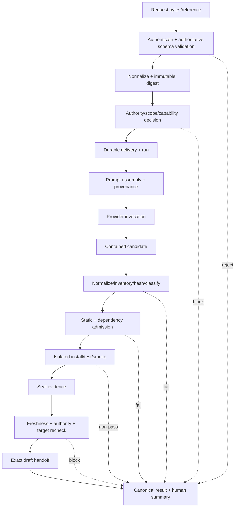
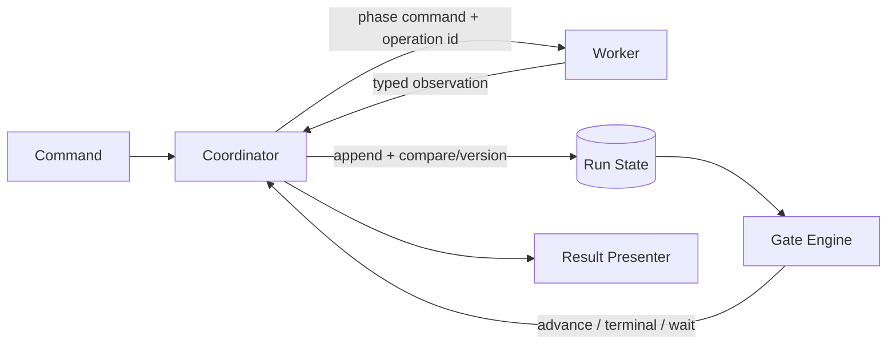
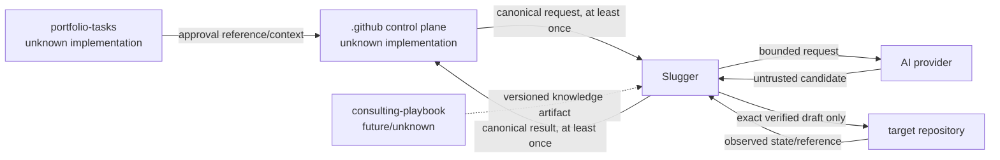

# Data Flow Design

## Inputs, outputs, and classifications

| Flow | Required content | Trust/classification | Owner |
|---|---|---|---|
| Canonical request | Contract/version, stable identities, approved intent, constraints, target/base/branch, authority, handling, immutable digest | Authenticated but untrusted until canonical and authority validation | Control plane/portfolio for assertions |
| Local request | Intent, capability, target and explicit governed authority mechanism | Untrusted user input | Requester; Slugger owns parsing |
| Provider request | Minimal bounded intent, scope, file/behavior contract, limits, prompt provenance | May contain confidential intent; no publication secret | Slugger |
| Provider response | Candidate files/receipt/usage/error | Hostile/untrusted | Provider owns claim; Slugger owns receipt |
| Dependency material | Package bytes/metadata/integrity | Supply-chain untrusted until admitted | Source owns bytes; Slugger observes |
| Verification observations | commands/profile, environment, exit/timeout/output digest | Sensitive until redacted; observed fact | Slugger |
| Evidence package | identities, scope, manifest, gates, provenance, limits, actions | Classified, integrity-protected | Slugger |
| Draft handoff | Exact approved files, ownership marker, reviewer-safe evidence | Target-visible | Slugger until handoff, target thereafter |
| Result | canonical outcome/error/retryability/evidence/publication/human action | Contract-classified and redacted | Slugger observation via control plane |
| Telemetry | Aggregated operational signals | Optional; no sensitive content by default | Deployment operator |

## End-to-end transformation

Transformations never discard root identity or provenance. Human text remains a data field and cannot create control instructions. Redaction produces a derived view; the protected source record remains access-controlled according to retention policy.

## Command and control flow

Inbound adapters issue commands to the application boundary. The Run Coordinator decides the next legal phase from durable state; components return typed observations but cannot advance themselves. Gate decisions control progression. Cancellation stops new side effects, records outcome, and triggers ownership-safe cleanup. Health/telemetry signals never authorize business transitions.

## Event flow

Domain events are committed facts: `DeliveryAccepted`, `RunCreated`, `PhaseStarted`, `PhaseObserved`, `CandidateInventoried`, `GateEvaluated`, `EvidenceSealed`, `PublicationReconciled`, `DraftHandedOff`, `RunTerminated`. They carry event ID, aggregate/version, time, actor, correlation, causation, subject digests, safe metadata and schema version. Events may drive observers after commit; they do not replace aggregate consistency. External conceptual events are mapped through versioned adapters and at-least-once delivery is assumed.

## Failure and recovery flow

Before a side effect, record operation intent. After a response, record observation atomically with the transition. If interrupted between them, a recovering coordinator queries/reconciles the external operation using its stable identity. It does not blindly replay non-idempotent operations. Changed candidate/config/policy/tool/environment invalidates dependent evidence and returns control to the earliest affected phase.

## Repository boundary flows

No flow implies filesystem access, shared schema ownership, direct issue mutation, or shared persistence. Missing required flow semantics block production use.
