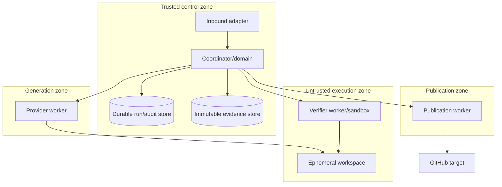

# Deployment Architecture

> The organization next MVP defines no merge, release, deployment, or production operation. Target-registry enablement and rollback order are organization-owned gates. Passing local conformance does not enable Slugger; a registry-disabled target remains disabled.

## Conceptual topology

Deployment technology is intentionally unspecified. A minimal deployment may run logical units in one host/process while maintaining trust and data boundaries; production may isolate them physically.

## Logical deployment units

| Unit | Characteristics | Credentials/network |
|---|---|---|
| Interface | Stateless validation/presentation; horizontally scalable | Control-plane/user auth; no provider/target credential |
| Coordinator | Trusted state-transition authority; restartable | Stores and adapters through policy; no generated execution |
| Generation worker | Quota/cost constrained provider invocation | Provider credential only; bounded provider egress |
| Verifier worker | Disposable high-risk execution | No provider/target secrets; deny network by default; approved dependency channel only |
| Publication worker | Low concurrency, high integrity | Target-scoped credential only; reads sealed package, not mutable workspace |
| Durable state/audit | Strong consistency for identity/transitions/outbox | Restricted control-plane access; backup/restore/tamper controls |
| Evidence/artifact store | Immutable objects, classification/retention | Digest verification and purpose-based access |

## Scaling

Scale interfaces, generation, and verification independently. Partition work by delivery ID; serialize publication by publication identity. Apply admission control and separate queues/quotas per phase, tenant/classification and provider. Workspace and output limits prevent a run monopolizing capacity. Cache only verified immutable dependency/tool artifacts, never authorization or gate freshness beyond policy.

## Availability and recovery

Coordinator instances are replaceable; durable state is the recovery authority. Define RPO/RTO and consistency before production. External outages open circuit breakers and produce retained pending/blocked/retryable state. Backups include schema/version and integrity checks; restore drills must prove no duplicate publication or rollback of authority/evidence. Multi-region operation, if needed, must preserve single ownership per delivery and data residency—active/active is not assumed.

## Environment separation

Development/test/certification/production have distinct identities, credentials, targets and evidence. Test adapters cannot be accidentally selected in supported production. Certification scenarios are not the user workflow. Runtime state lives outside source/package directories. Generated workspaces never mount Slugger source, host credential stores, control sockets, or unrestricted network.

## Release and rollback

Slugger release is distinct from generated-project handoff. A release carries contracts, capability catalog, migrations, threat/conformance evidence and compatibility matrix. Rollback must account for in-flight runs, state/evidence schema, contract version and target marker compatibility; never downgrade by silently reinterpreting records. Deployment health failure stops new work while preserving/querying accepted runs.
