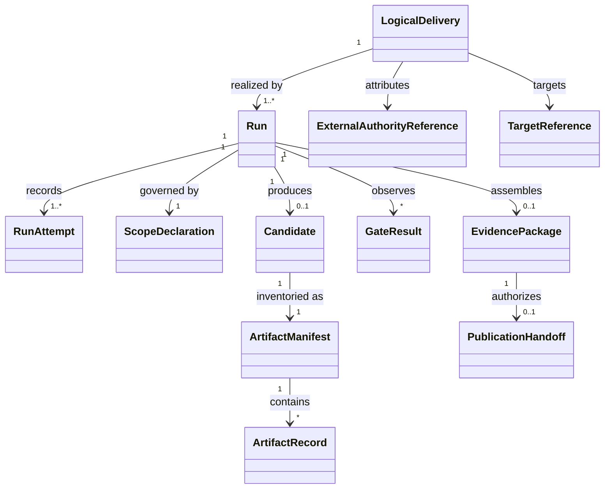

# Domain Model

## Bounded context

The Slugger domain is **governed candidate production and draft handoff**. Portfolio governance, organization routing/contracts, AI model behavior, target governance, and generated-product operation are neighboring contexts represented only by attributed references and ports.

## Aggregates and entities

### Logical Delivery aggregate

**Root:** `LogicalDelivery`. Stable idempotency identity for a canonical approved revision. Contains canonical contract reference, task/correlation/source/approval references, immutable-input digest, requested capability and target, and its runs. Invariant: the identity never binds two immutable inputs; redelivery converges rather than creates a new publication owner.

### Run aggregate

**Root:** `Run`. Slugger-owned execution with scope, effective policy/config digest, state/version, attempts, phase records, candidate/evidence/publication references, and terminal outcome. It alone authorizes transitions. A `RunAttempt` records retry lineage, timing, actor and resource/usage facts; it never owns publication identity.

### Candidate aggregate

**Root:** `Candidate`. Untrusted provider output bound to provider request/receipt and workspace ownership. Its `ArtifactManifest` contains `ArtifactRecord` entities with normalized path, media/type, size, digest, origin and disposition. Any content change creates a new candidate revision/digest and invalidates observations.

### Evidence aggregate

**Root:** `EvidencePackage`. Immutable correlated summary of input/scope, versions, provenance, manifest, gate observations, state history, errors, limitations, publication and outstanding human decisions. Gate results are observations, not candidate claims. Integrity identity changes if any bound content changes.

### Publication Handoff aggregate

**Root:** `PublicationHandoff`. Binds stable publication identity, exact manifest/evidence digest, target/base/branch, ownership marker, attempt history and observed PR reference/state. It permits mutation only of structurally proven managed work and never represents merge authority.

## Value objects

| Value object | Semantics / validation |
|---|---|
| DeliveryId, RunId, AttemptId | Opaque, stable, non-interchangeable identities. |
| CorrelationId | End-to-end provenance; not deduplication. |
| ImmutableInputDigest | Canonical integrity identity of authority/execution/publication-affecting fields. |
| ContentDigest | Algorithm-qualified digest of bytes/canonical record. |
| ContractRef | Owner, kind, semantic version/release, validator identity. |
| AuthorityRef | External owner, approval identity/revision/scope/time/status and proof reference. |
| ScopeDeclaration | Accepted objective/class, promises, constraints, exclusions, human obligations, profile version. |
| CapabilityProfile | Status, version, contracts, policies, verifier, limits and promotion evidence. |
| WorkspaceOwnership | Run binding, root, creation proof and cleanup policy; never merely a path. |
| GateBinding / GateStatus | Subject and environment binding plus non-Boolean status. |
| PublicationIdentity | Contract-defined deterministic ownership identity independent of attempt/time. |
| ErrorRecord | Category, phase, retryability, safe message/reference, cause chain, affected evidence. |
| ExternalReference | Owner-qualified immutable reference/snapshot; never copied authority. |

## Relationships and ownership

A delivery may have multiple runs only under explicit recovery/migration policy, but one active publication owner. A run owns attempts and phase history. A candidate owns its manifest; artifacts cannot silently move between candidates. Evidence references observations and snapshots without becoming their owner. A target PR exists outside the aggregate; the handoff stores an observed reference and proof.

## Business invariants

* Approval is external, attributable, current, scoped, and rechecked; Slugger cannot manufacture it.
* Candidate is untrusted even after provider success.
* Only exact, current, all-pass gates over the same bindings enable draft publication.
* `FAIL`, `ERROR`, `TIMED_OUT`, `SKIPPED`, `NOT_RUN`, `STALE`, missing, or unknown all deny progression.
* Target ambiguity or insufficient ownership proof is preserved for humans.
* A verified MVP candidate is not “production-ready.”
* External facts retain their source and observation time.
* Historical records are append-only/corrected by superseding records, never silently rewritten.

## Conceptual lifecycle

Delivery is received/rejected/accepted; Run is created through terminal outcome; Candidate progresses from absent to generated/inventoried/admitted/verified or discarded; Evidence progresses from accumulating to sealed/superseded; Handoff progresses from absent through preflight/publishing/handed-off or blocked/uncertain. Detailed transitions are in [State Models](StateModels.md). This is a conceptual model, not a database schema.
