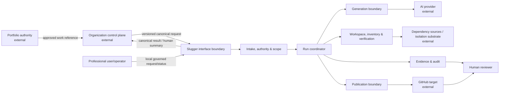
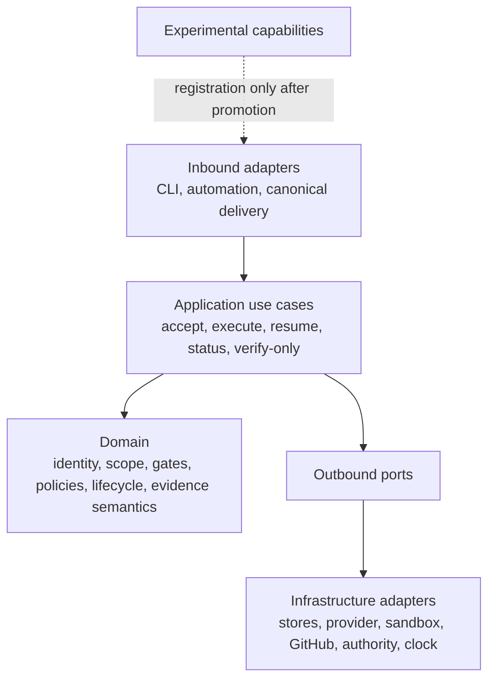

# High-Level Design

## Context and decomposition

## Architectural layers

**Dependency rule:** Domain imports nothing outward. Application depends on domain and port abstractions. Adapters depend inward. Composition is the sole place selecting adapters. Experimental code has no dependency edge into supported domain/application paths.

## Major subsystems and responsibilities

| Subsystem | Responsibility | Owns | Does not own |
|---|---|---|---|
| Interface | Authenticate/parse, validate canonical envelope, normalize command, render safe result | Slugger endpoint behavior | External schema vocabulary |
| Governance | Authority verification, scope and capability decision, target policy | Effective execution decision | Portfolio approval itself |
| Run control | Identity, locking, phase orchestration, checkpoint, retry/resume | Run/attempt history | Workflow-run identity as delivery identity |
| Generation | Reproducible request, provider capability/limits, normalized response | Request digest/provenance | Provider algorithm or truth of output |
| Candidate safety | Workspace containment, inventory, static admission | Candidate manifest/dispositions | Trust in generated files |
| Verification | Dependency admission, isolated install/test/smoke | Observed check results | Production readiness |
| Evidence | Correlated, digest-bound review package and audit | Slugger observations | Re-authoring external facts |
| Publication | Preflight, gate decision, exact transfer, ownership reconciliation | Mutation of proven managed draft only | Merge/release/deployment |
| Operations | Config validation, secret brokerage, health, metrics, diagnostics | Effective config identity and safe operations | Sensitive telemetry by default |

## Primary information flow

Canonical request → trusted contract validation → immutable-input digest → scope declaration → durable delivery/run → authority and target preflight → bounded provider request → candidate workspace → protected manifest → static/dependency gates → isolated tests/smoke → evidence package → authority/gate freshness recheck → deterministic branch and one managed draft → canonical result. Each arrow records actor, phase, input/output digest and outcome.

## Ownership boundaries

There is no shared database with collaborators. External identities and decisions enter as attributed, integrity-protected references/snapshots. Slugger owns observations only inside its run boundary. After handoff, GitHub owns target objects; Slugger retains the exact published digest and reference. Control-plane delivery and result transport remain external contract matters.

## External dependencies

| Dependency | Needed behavior | Boundary response |
|---|---|---|
| Control plane | Authentic versioned routing and authoritative validator | Reject missing/unknown/misdirected requests; verification-only until validated. |
| Portfolio authority | Current attributable approval and change/withdrawal semantics | Hold when unverifiable; never infer. |
| Provider | Bounded request/response, cancellation, usage/error metadata | Normalize, time-bound, distrust all content. |
| Isolation substrate | Filesystem/process/network/resource containment | No generated execution if controls cannot be proven. |
| Dependency source | Integrity/policy-bounded acquisition | Reject unapproved/unpinned/unavailable dependencies. |
| GitHub/target | Preflight, owned branch/draft mutation, observable outcome | Least privilege, structural ownership, preserve ambiguity. |
| Credential authority | Phase-scoped secret delivery/rotation | No persistent/plaintext or generated-runtime exposure. |

## Scaling and availability model

Runs are independent except those sharing a delivery/publication identity. Stateless intake nodes may scale horizontally; coordinators claim durable leases; keyed serialization or compare-and-set protects a logical delivery. Generation and verification worker pools scale separately under quota/backpressure. Storage must remain consistent for identity, gates, and publication ownership. Availability degradation must preserve accepted state and return truthful pending/blocked/retryable outcomes rather than bypass controls.
