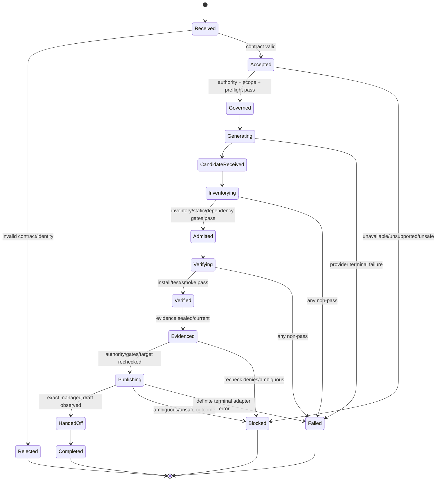
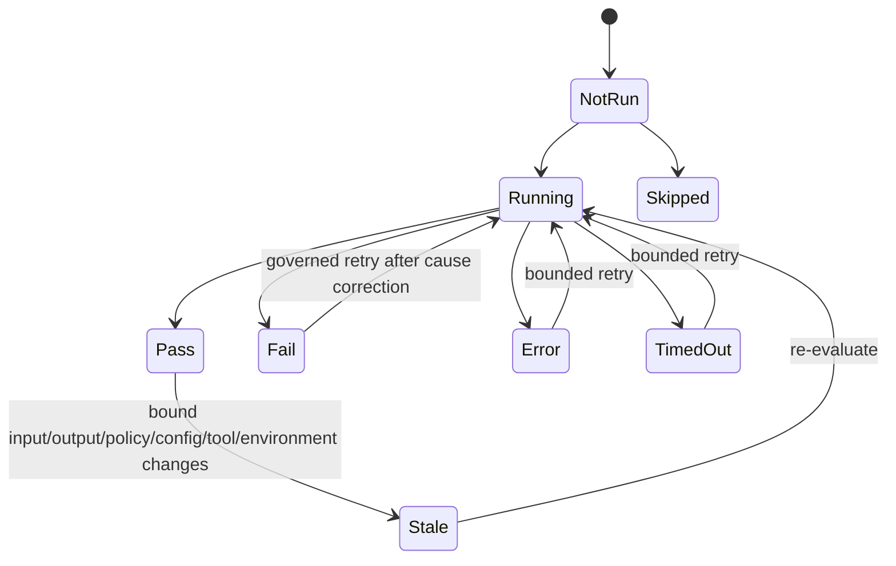
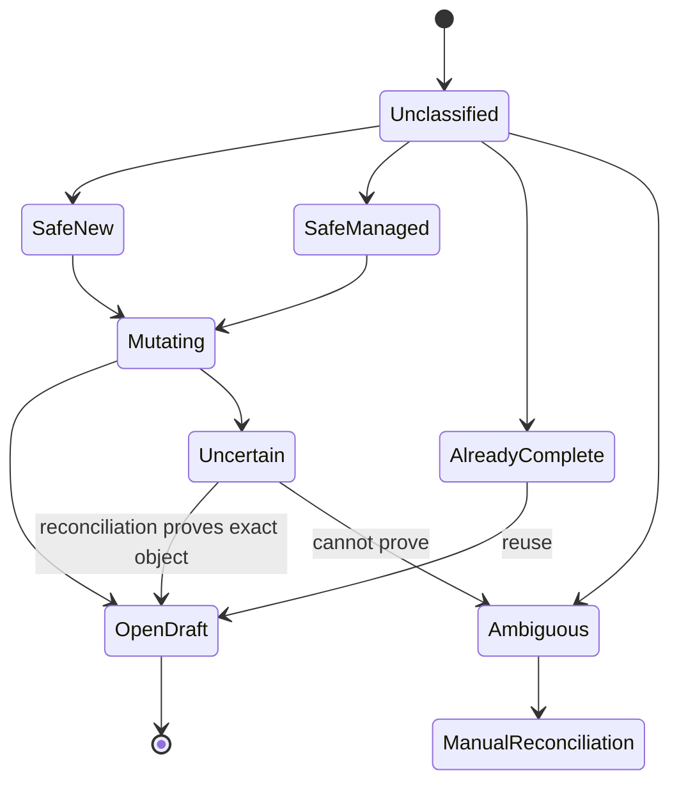

# State Models

> The organization next-MVP target lifecycle is the smaller model in [`docs/next-mvp.md`](../next-mvp.md#lifecycle-and-sequence). Names in this architecture are local observations and MUST be mapped to, not substituted for, the pinned organization's status vocabulary. No transition after draft creation enters ready, merge, release, or deployment.

## Run lifecycle

A persisted `Interrupted` recovery marker may apply to any nonterminal phase. Resume returns to the last trustworthy boundary after reconciliation and revalidation; it does not skip ahead. Cancellation transitions to `Cancelled` before new work and retains evidence. Terminal labels map through canonical result vocabulary rather than assuming identical external names.

## Transition conditions

| Transition | Entry requirements | Exit evidence / failure state |
|---|---|---|
| Received→Accepted | Authenticated authoritative contract; stable IDs; digest match | Acceptance journal; otherwise Rejected before provider/target mutation |
| Accepted→Governed | Current scoped approval, supported profile, complete scope, safe target preflight | Scope/authority snapshot; otherwise Blocked |
| Governed→CandidateReceived | Durable generation intent and bounded provider response | Receipt/request digest; provider error → Failed or retry wait |
| CandidateReceived→Admitted | Owned workspace; protected inventory; all admission gates PASS | Manifest/gates; any other status → Failed |
| Admitted→Verified | Controlled environment proven; dependency/install/test/smoke all PASS | Observation set; timeout/error/skip → Failed |
| Verified→Evidenced | Evidence complete, digest-bound, accessible and redacted views valid | Sealed evidence; store failure → Failed |
| Evidenced→Publishing | Fresh approval, unchanged bindings, current all-pass gates, unique safe target | Publication intent; denial/ambiguity → Blocked |
| Publishing→HandedOff | Exact files/marker on expected branch and one open draft proven | Handoff record; uncertainty → Blocked/reconcile |

## Gate state model

Only `Pass` that remains fresh can satisfy a dependency. `Skipped` is never implicit success.

## Candidate lifecycle

`Absent → ReceivedUntrusted → Inventoried → Admitted → Verified → PublishedSnapshot`, with terminal `Rejected` or `Discarded`. Mutation after inventory creates a new revision and returns to `ReceivedUntrusted`; it cannot preserve gate status. Publication snapshots exact verified bytes and does not make the mutable workspace authoritative.

## Evidence lifecycle

`Accumulating → Complete → Sealed → PublishedReference/Retained → Expired/DeletedByPolicy`. A binding change makes a sealed package `Superseded`, never edits it in place. Deletion requires ownership, policy authorization and an audit tombstone.

## Publication lifecycle

Closed, merged, non-draft, wrong-base, multiply matching, unowned, or conflicting-marker objects are `Ambiguous`; Slugger neither recreates nor modifies them automatically.
