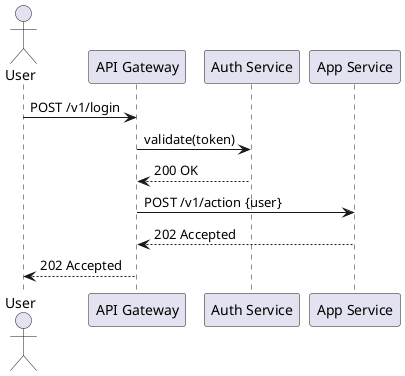
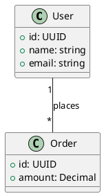
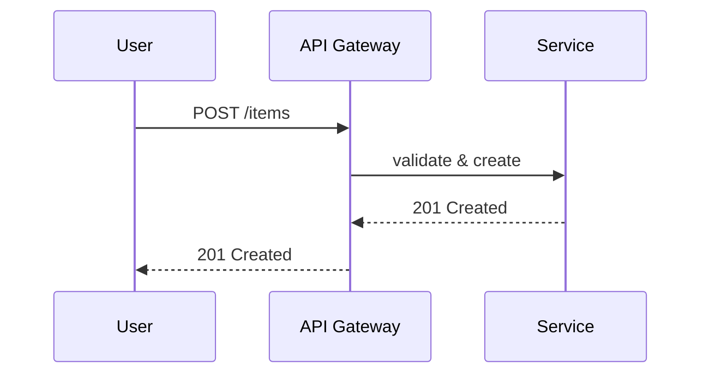
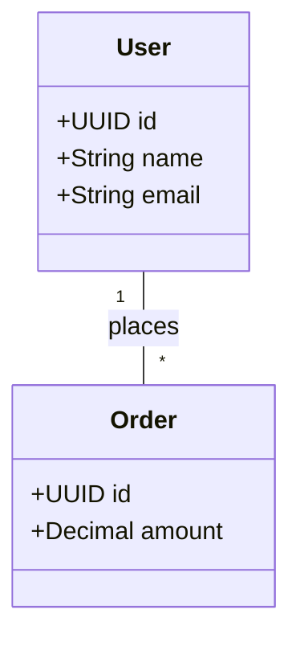

<!--
  templates/UML.md
  Purpose: Detailed UML templates and guidance for documenting architecture and behavior.
  Replace placeholders and use PlantUML/Mermaid sources kept in version control.
-->

# UML Templates & Guidance

Purpose
- Provide reusable UML templates and best-practices for documenting system architecture, data models, and interaction flows.
- Store source (PlantUML / Mermaid) in version control so diagrams can be reviewed and diffed.

Recommended diagram types
- Context diagram: show system boundary and external actors.
- Component (Container) diagram: services, responsibilities, and major interfaces.
- Sequence diagram: message flows for critical use cases.
- Class diagram: domain model and relationships.
- Deployment diagram: runtime nodes and infrastructure mapping.

Conventions
- Name diagrams with a clear prefix and short description, e.g., `context-auth-service.puml` or `sequence-login.mmd`.
- Use consistent actor/component names across diagrams.
- Keep each diagram focused on a single concern.
- Provide a brief text summary alongside each diagram for accessibility and reviewers who cannot view images.

Storage & file layout (suggested)
- docs/diagrams/
  - plantuml/  (source .puml files)
  - mermaid/   (source .mmd files)
  - exports/   (png/svg/pdf for presentations)

PlantUML examples
- Sequence diagram example (PlantUML):

- Class diagram example (PlantUML):

Mermaid examples
- Sequence diagram example (Mermaid):

- Class diagram example (Mermaid - limited):

Accessibility & review
- Always include a plain-text caption and short description under the diagram so readers with visual impairments or in text-only environments understand intent.
- Keep the diagram source in the repo to enable diffs and history.

Versioning & maintenance
- When updating diagrams, update the summary and include the reason in the commit/PR.
- Prefer small incremental changes to large rewrites to make reviews easier.

